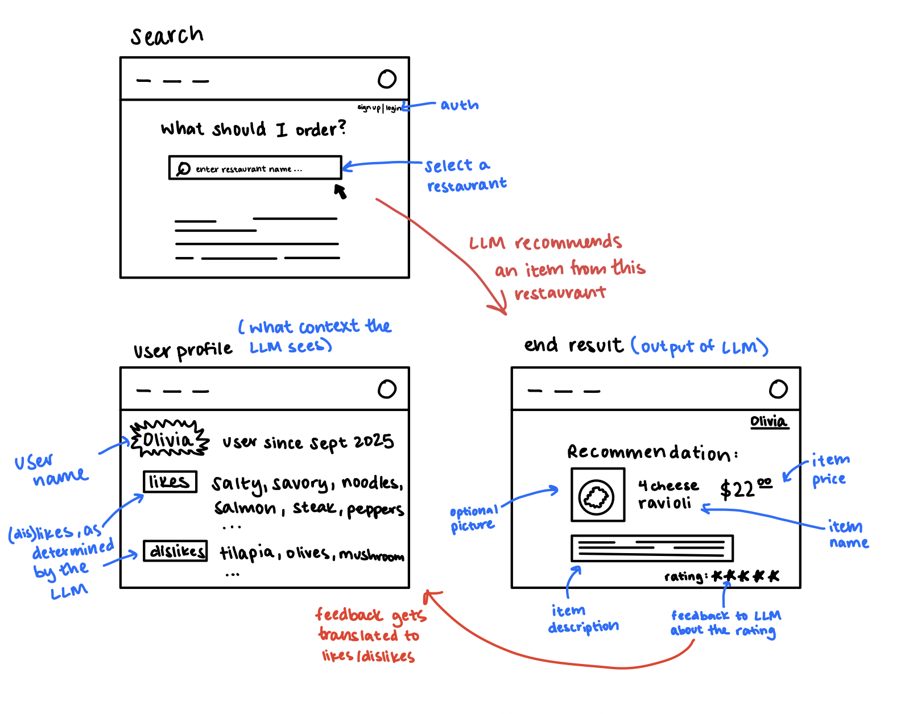

# Assignment 3: An AI-Augmented Concept

## Augment the design of a concept

### Original Concept

```
concept Recommend [Item, Policy]
    purpose select an element from a set according to a policy
    principle based on the specified policy, return a single element from a set
    state
        a policy Policy
        a set of candidates set(Item)
        a recommendation Item
    actions
        addPolicy (newPolicy: Policy)
            requires: the old policy is not the same as newPolicy
            effects: updates the policy include the newPolicy

        addCandidate (newCandidates: Item)
            requires: newCandidate is non empty
            effects: adds the new candidate to the set of candidates

        updateCandidates (newCandidates: set(Item))
            requires: newCandidates is non empty
            effects: updates the set of candidates to newCandidates

        recommend (candidates: set(Item), policy: Policy): (recommendation: Item)
            requires: candidates is non empty
            effects: returns one element from candidates according to the given policy

```

### AI-Augmented Concept

```
concept Recommend [Item, Policy]
    purpose select an element from a set according to an inferred preference policy
    principle return a single element from a set using an LLM that interprets a learned user preference profile (policy) and reasons over item descriptions (candidates) to recommend the best match
    state
        a set of candidates set(Item)
        a policy Policy
        a recommendation Item

    actions
        addPolicy (newPolicy: Policy)
            requires: the old policy is not the same as newPolicy
            effects: updates the policy include the newPolicy

        addCandidate (newCandidates: Item)
            requires: newCandidate is non empty
            effects: adds the new candidate to the set of candidates

        updateCandidates (newCandidates: set(Item))
            requires: newCandidates is non empty
            effects: updates the set of candidates to newCandidates

        recommend(candidates: set(Item), policy: Policy): (recommendation: Item)
            requires: candidates is non empty
            effects: calls the LLM with candidate descriptions and the current policy. The LLM reasons about the policy and how it can be applied to candidates. Returns the item determined to best match the policy.


```

### Explanation

The AI-augmented version extends the original recommendation concept by allowing the policy to represent an inferred model of user preferences, rather than an explicit rule like "likes peanuts". The LLM uses this policy, derived from the user’s prior feedback and ratings, to interpret and compare the available candidates.

Instead of relying on deterministic logic, the augmented system leverages the LLM’s ability to reason about unstructured data in the form of the policy. It interprets menu item descriptions (candidates) and aligns them with the user’s inferred likes and dislikes (policy), producing a personalized recommendation that evolves as preferences change over time.

---

## Design the user interaction

### Sketches with AI Augmentation



### User Journey

A new user signs up for the app and explores their first restaurant. They browse the menu, rate a few dishes they’ve tried before, and the app begins forming an initial preference profile. That evening, the user opens the app to decide what to eat. They select a nearby restaurant, and the app automatically recommends a a peanut-free noodle bowl, which is inferred from the user’s early ratings. Relieved they don’t have to scan the menu, the user orders it and enjoys their meal. After dinner, the user rates the dish a 4/5. The app updates the user’s preference profile based on this feedback. The next time the user visits another restaurant, the app applies their updated profile and recommends a spicy tofu curry, better aligned with their evolving tastes. The user gives it a 5/5 and notices that the recommendations feel increasingly personalized without ever having to specify their preferences directly.

---

## Concept Implementation

- [Link to concept implementation](recommend.ts)
- [Link to concept spec](recommend.spec)
- Test driver: `npm test`

---

## Test Cases/Prompts

- [Link to test file](recommend-test.ts)

### Test 1: Semantic Similarity Prompt

- **Approach:** The goal of this test was to see whether the recommender could generalize a single strong preference (“Sushi”, which was rated 5/5) to similar dishes in the menu, such as “Sushi Rolls” or “Ramen”. This was done by prompting the LLM to reason by semantic similarity, rather than direct string matching.
- **What Worked:** The model consistently recommended dishes like “Sushi Rolls”, showing that it could use semantic similarity rather than relying on exact 1:1 matches! Explicitly telling it to “infer similar foods” in the prompt improved reasoning consistency compared to a generic prompt with no such guidance.
- **What Went Wrong:** Occasionally, the LLM hallucinated menu items (“Salmon Sashimi”) that weren’t in the provided list, but adding a stronger constraint (“only select dishes from the list below”) fixed most of those violations.
- **What Issues Remain:** Minor inconsistencies can occur when menu items are phrased differently (e.g., “Sushi roll” vs. “Sushi rolls”), suggesting the LLM is sensitive to spelling variation (reasoning is not entirely semantic).

### Test 2: Conflicting Preferences Prompt

- **Approach:** This case explored how the model manages preference conflicts, e.g. liking “spicy” (5/5) but disliking “curry” (2/5). The goal was to see if the LLM could resolve trade-offs rather than ignoring one or both preferences.
- **What Worked:** The model seemed to prioritize the foods with a stronger preference. It recommended “Chili Ramen” in most runs, which satisfies “spicy” without violating the “curry” dislike.
- **What Went Wrong:** When the phrasing of the prompt was ambiguous (“avoid dishes you think might be disliked”), the model over-filtered and produced overly safe, generic answers (“Tofu Stir Fry”).
- **What Issues Remain:** The LLM doesn’t seem to actually perform numeric reasoning, but instead mimic it with text. The results varied if the preference descriptions are reordered or reworded.

### Test 3: Noisy Menu Prompt

- **Approach:** The goal of this test was to measure the robustness when given an imperfect candidate set. The menu items contained typos and common abbreviations (e.g., “Vegtble Noodlz w/ tofu”). The LLM was prompted to infer intended meanings, but still only return items from the provided list.
- **What Worked:** The LLM handled light these surprisingly well, and it still selected the most appropriate dish most of the time.
- **What Went Wrong:** When multiple menu items looked similar, the LLM sometimes defaulted to the first in the list rather than reasoning contextually.
- **What Issues Remain:** The LLM doesn't have a good way to clean/normalize the candidates, which poses a challenge since we want to ensure that it only outputs a valid menu item.

---

## Validators

- Ambiguous/Empty Recommendation: The plausible issue is that the LLM returns a vague or invalid answer like “Any of these would work” or an empty string. This is checked with the function `validateRecommendationIsSpecific()`

- Invalid Recommendation (i.e. the item recommended is not in the candidates set): The plausible issue is that the LLM hallucinates and recommends an item that doesn’t exist in the provided candidate. This is checked with the function `validateRecommendationInCandidates()`

- Policy Inconsistency: The plausible issue is that when updating user preferences, the LLM might try to assign invalid ratings to a food. We want to make sure that each preference rating needs to be between 1 and 5. This is checked with the function `validatePolicyConsistency()`

Overall, there are three plausible issues that could emerge when using the LLM: ambiguous or empty recommendation, invalid recommendation, and policy inconsistencies. To handle these, I implemented corresponding validators that check each of these conditions before finalizing recommendations (all wrapped in a validate function). This way, even if the LLM produces something invalid or incorrect, the user experience is unaffected.

## Run App

`npm test`
