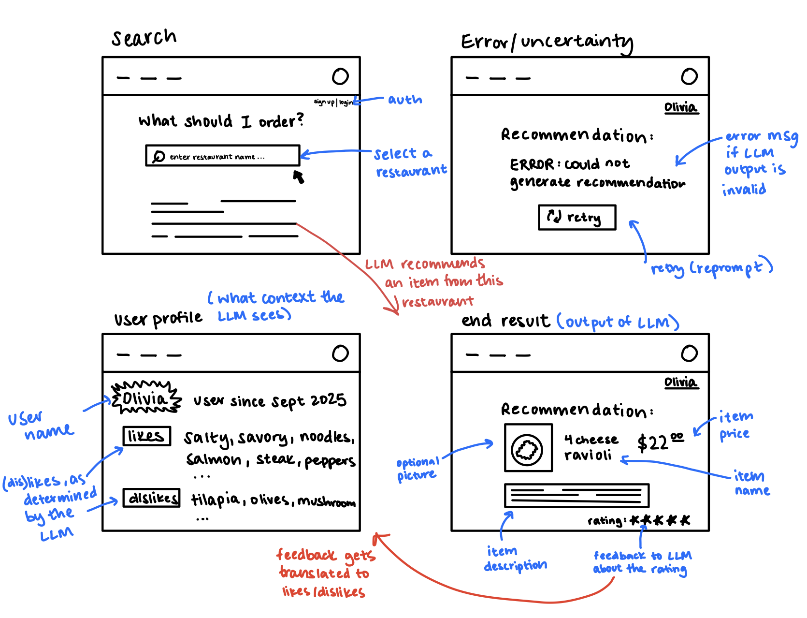

# Assignment 3: An AI-Augmented Concept

## Augment the design of a concept

### Original Concept Spec

```
concept Recommend [Item, Policy]
    purpose select an element from a set according to a policy
    principle based on the specified policy, return a single element from a set
    state
        a set of Recommenders with
            a policy Policy
            a set of candidates set(Item)
    actions
        recommend (candidates: set(Item), policy: Policy): (item: Item)
            requires: candidates is non empty
            effects: returns one element from candidates according to the given policy

        updatePolicy (oldPolicy: Policy, newPolicy: Policy)
            requires: oldPolicy exists, oldPolicy is not the same as newPolicy
            effects: updates the policy from oldPolicy to newPolicy

        updateCandidates (oldCandidates: set(Item), newCandidates: set(Item))
            requires: newCandidates is non empty, oldCandidates is not the same as newCandidates
            effects: updates the list of candidates from oldCandidates to newCandidates
```

### AI-Augmented Concept

```
concept SmartRecommend [Item]
    purpose select an element from a set according to a policy using an LLM
    principle return a single element from a set using an LLM to reason about the candidates and produce a context-aware recommendation
    state
        a set of Recommenders with
          a naturalLanguagePolicy: text
          a set of candidates: set(Item)

    actions
        aiRecommend(candidates: set(Item), naturalLanguagePolicy: text): (item: Item)
            requires: candidates is non empty
            effects: calls the LLM with the naturalLanguagePolicy and candidates. Receives and returns an item recommendation from the LLM from the set of candidates

        updatePolicy(oldPolicy: text, newPolicy: text)
            requires: oldPolicy exists and differs from newPolicy
            effects: updates the policy text

        updateCandidates(oldCandidates: set(Item), newCandidates: set(Item))
            requires: newCandidates is non empty and differs from oldCandidates
            effects: updates the list of candidates
```

### Explanation

The AI-augmented version of this concept builds on the original by expanding how the policy is defined/interpreted. Instead of relying on a fixed, predefined rule (e.g. "best match" or "health-conscious"), the policy can now be expressed in natural language and interpreted by an LLM. The LLM takes in both the policy description and the candidate set, then infers the best choice based on contextual cues rather than a deterministic selection rule. This allows the recommender to handle goals that would be difficult to capture with predefined logic. Additionally, over time, the model can incorporate different candidate descriptions and more specific user preferences, producing more accurate and personalized recommendations.

---

## Design the user interaction

### Sketches with AI Augmentation



### User Journey

A new user signs up for the app and creates a profile, listing their initial dietary preferences: likes sweets, wants to hit protein goals, and hates peanuts. The app saves these preferences, classifying them through the LLM.

That evening, the user opens the app to find dinner, so they select a nearby restaurant from the Home page. The app applies the saved preferences and recommends a peanut-free noodle bowl. Relieved they don’t have to scan the entire menu, the user chooses it and enjoys their meal. Afterwards, they rate the bowl a 4/5, helping the app refine their preferences.

A week later, the user visits a different restaurant. The app filters the menu based on their updated profile and suggests a sweet and spicy yakisoba. The user enjoys it and feels that the app understands their tastes better over time, rating it a 5/5.
